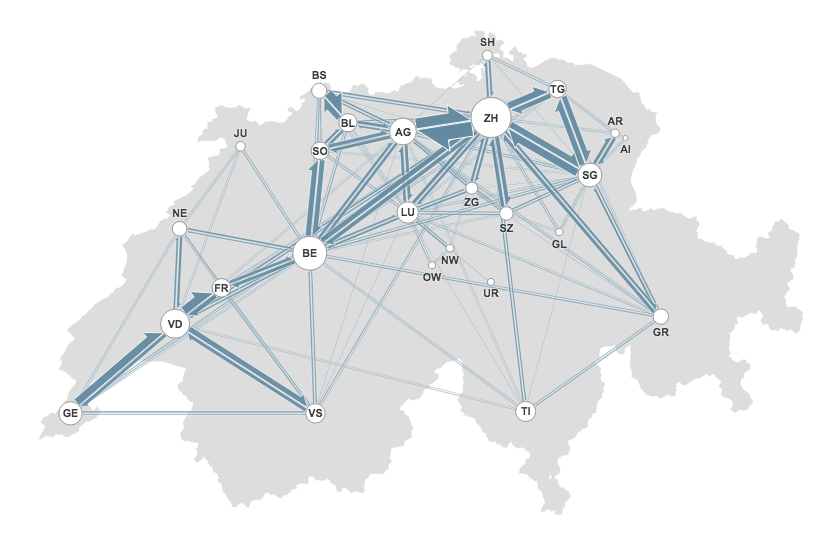

# SVG flowline

A helper function for drawing flow lines (half-barbed arrows) with SVG (or Canvas). 
The lines look like in this visualization: 

##  Example

Check out [this observable notebook](https://beta.observablehq.com/@ilyabo/mapping-airline-data-from-a-mapd-database/2) for a usage example. 

## Usage with npm

    npm install svg-flowline
    
